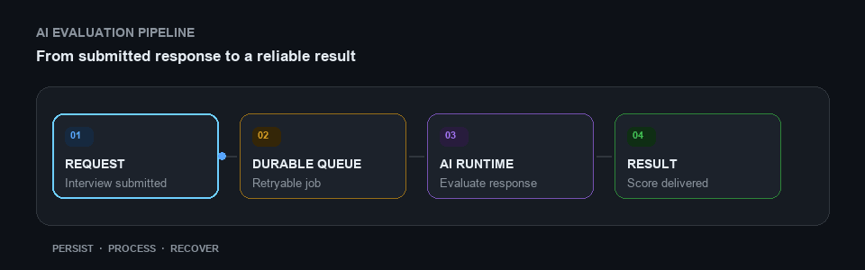

# Chan / yuhyeongchan

**Backend Engineer · Java / Spring · AI Runtime · Cloud & Distributed Systems**

Building reliable backend services and practical tools, from AI evaluation pipelines to native macOS utilities.

▶ Explore an AI evaluation workflow

## Selected Impact

| **50K messages** | **~40 / sec** | **10s → 1s** |
| --- | --- | --- |
| Queue preparation reduced from 2 hours to 1 minute | Email delivery throughput with Amazon SES | Java Lambda cold start with SnapStart |

## What I Build

- Backend systems for AI interviews and evaluations, including LLM pipelines, durable job processing, and multi-tenant data workflows.
- Event-driven services and cloud operations across AWS, Kubernetes, Kafka, and GitOps delivery.
- AI applications with Spring AI, LangChain4j, OpenAI models, and speech-to-text / text-to-speech.
- Local-first desktop tools, browser utilities, and native macOS integrations.
- Open-source fixes and systems work in Rust, process memory access, and macOS tooling.

## Open Source Contributions

- [VHS](https://github.com/charmbracelet/vhs) — Fixed GIF output not being generated after recording; merged upstream and included in [v0.12.1](https://github.com/charmbracelet/vhs/releases/tag/v0.12.1). ([Issue #787](https://github.com/charmbracelet/vhs/issues/787), [PR #788](https://github.com/charmbracelet/vhs/pull/788))
- [CXX](https://github.com/dtolnay/cxx) — Fixed `cxx-build` failures when shared-header paths cannot be written or linked; included in [1.0.202](https://github.com/dtolnay/cxx/releases/tag/1.0.202). ([PR #1760](https://github.com/dtolnay/cxx/pull/1760))
- [FileBrowser](https://github.com/gtsteffaniak/filebrowser) — Fixed valid parallel uploads being interrupted by per-file inactivity timeouts; merged upstream and included in [v2.0.7-beta](https://github.com/gtsteffaniak/filebrowser/releases/tag/v2.0.7-beta). ([PR #2950](https://github.com/gtsteffaniak/filebrowser/pull/2950))
- [Wuma Tracker](https://github.com/wuwamoe/wuma-tracker) — Added native macOS tracker support with a Mach-based process-memory backend and shared Windows/macOS process abstraction. ([PR #6](https://github.com/wuwamoe/wuma-tracker/pull/6))

## Tech Stack

Explore technologies by category

<h3>Backend &amp; APIs</h3>

<h3>AI Runtime</h3>

<h3>Data &amp; Messaging</h3>

<h3>Cloud &amp; Delivery</h3>

<h3>Systems &amp; Open Source</h3>

## Links

- GitHub: [github.com/gudcks0305](https://github.com/gudcks0305)
- Blog: [velog.io/@gudcks0305](https://velog.io/@gudcks0305)

